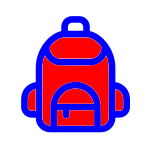
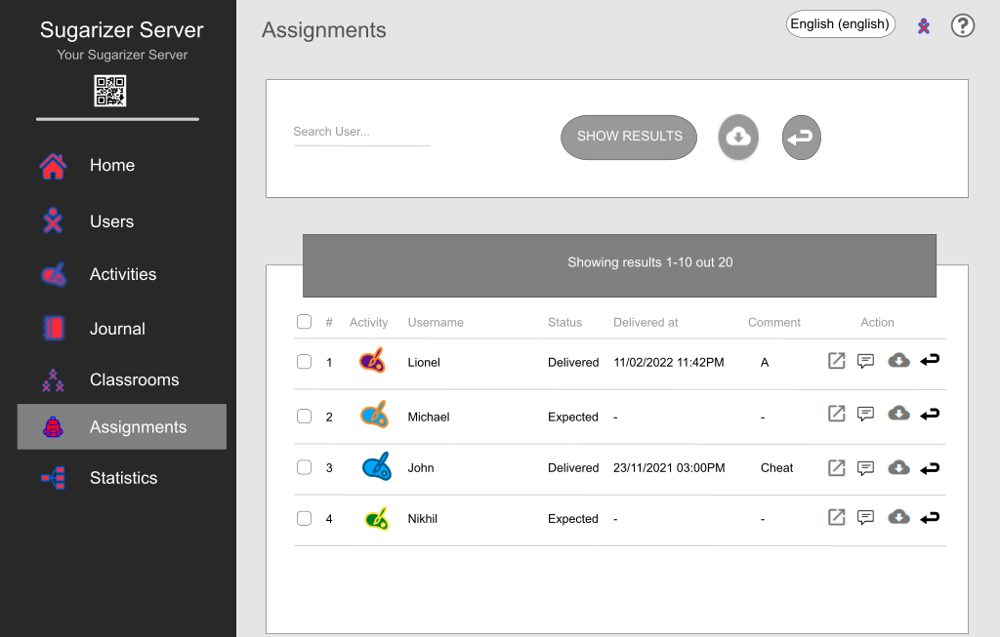
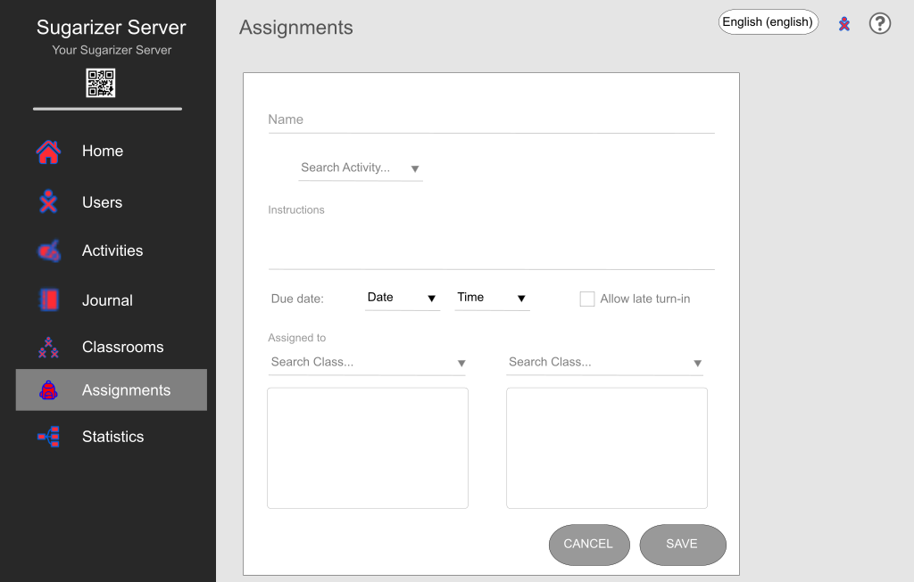
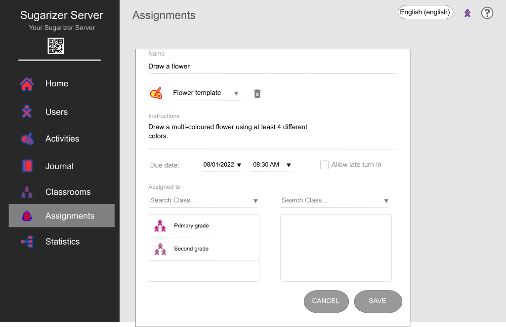
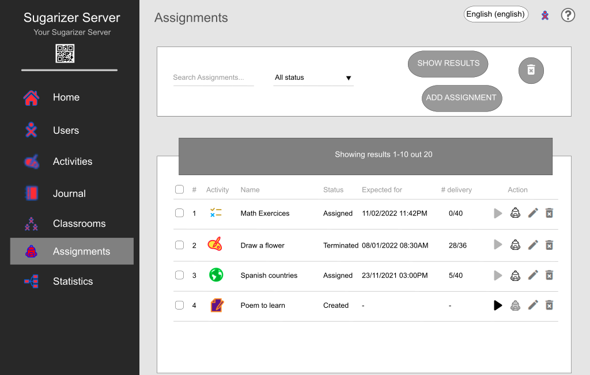
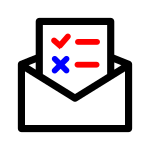

# GSoC 2022 Ideas

## Project Ideas
* [Improve and maintain 12 Sugar activities](#improve-and-maintain-12-sugar-activities)
* [Improve and maintain 8 Sugar activities](#improve-and-maintain-6-sugar-activities)
* [Port Sugar and core activities to Python 3](#port-sugar-and-core-activities-to-python-3)
* [Sugarizer Assignments](#sugarizer-assignments)
* [Sugarizer Exerciser Evaluation mode](#exerciser-evaluation-mode)
* [Sugarizer Vue.js UI](#sugarizer-vuejs-ui)
* [Music Blocks v3 maintenance](#music-blocks-v3-maintenance)
* [Sugar on Raspberry Pi](#sugar-on-raspberry-pi)
* [Music Blocks 4 Builder Framework](#music-blocks-4-builder-framework)
* [Music Blocks 4 Code Editor](#music-blocks-4-code-editor)
* [Music Blocks 4 More Syntax Elements and Tests](#music-blocks-4-more-syntax-elements-and-tests)
* [Music Blocks 4 Export/Import](#music-blocks-4-export-import)
* [Music Blocks 4 Internationalisation](#music-blocks-4-internationalisation)
* [Music Blocks 4 Webpack Setup](#music-blocks-4-webpack-setup)

[Administrative notes](#administrative-notes)

------------

## Improve and maintain 12 Sugar activities

**Prerequisites** 
 - Experience with Python
 - Strong experience with Sugar activities
 - Experience with maintaining activities on ASLO and ASLO-v4

**Description** 
Sugar has a lot of activities, with 250+ on GitHub, and more
elsewhere. These have scope for improvement; bugs,
features, updated human translations, and release.  This project will involve
working on **at least 12** activities to improve them. Students can choose
activities on their own, and are encouraged to select activities which
are either a part of Fructose or have a strong pedagogical value. To
understand how to locate and work on activities, see our guide to
[Modifying
Activities](https://github.com/sugarlabs/sugar-docs/blob/master/src/contributing.md#modifying-activities)

In their proposal, students may mention _some_ of the issues they will
work on.  Any new feature suggestion should be discussed on GitHub
Issues or on the mailing list before being added to a proposal.

Since there are a lot of activities to work on, **more than one instance
of this project may be selected**.

**Suggested Issues to work on:** 
 - jukebox-activity: [#22 Add collaboration for sharing playlist items](https://github.com/sugarlabs/jukebox-activity/issues/22)

Other issues will have been raised since.

Suggesting or adding features, fixing bugs, or releasing activities
will help you to gain experience

**Project Length** 

**350** hours

**Difficulty** 

**Medium**

**Coding Mentors** 
[Ibiam Chihurumnaya](https://github.com/chimosky/), 
[Srevin Saju](https://github.com/srevinsaju/)

**Assisting Mentors** 
To be added.

------------

## Improve and maintain 8 Sugar activities

**Prerequisites** 
 - Experience with Python
 - Strong experience with Sugar activities
 - Experience with maintaining activities on ASLO and ASLO-v4

**Description** 
Sugar has a lot of activities, with 250+ on GitHub, and more
elsewhere. These have scope for improvement; bugs,
features, updated human translations, and release.  This project will involve
working on **at least 6** activities to improve them. Students can choose
activities on their own, and are encouraged to select activities which
are either a part of Fructose or have a strong pedagogical value. To
understand how to locate and work on activities, see our guide to
[Modifying
Activities](https://github.com/sugarlabs/sugar-docs/blob/master/src/contributing.md#modifying-activities)

In their proposal, students may mention _some_ of the issues they will
work on.  Any new feature suggestion should be discussed on GitHub
Issues or on the mailing list before being added to a proposal.

Since there are a lot of activities to work on, **more than one instance
of this project may be selected**.

**Suggested Issues to work on:** 
 - jukebox-activity: [#22 Add collaboration for sharing playlist items](https://github.com/sugarlabs/jukebox-activity/issues/22)

Other issues will have been raised since.

Suggesting or adding features, fixing bugs, or releasing activities
will help you to gain experience.

**Project Length** 
**175** hours

**Difficulty** 

**Medium**

**Coding Mentors** 
[Ibiam Chihurumnaya](https://github.com/chimosky/),
[Srevin Saju](https://github.com/srevinsaju/)

**Assisting Mentors** 
To be added.

------------

## Port Sugar and core activities to Python 3

**Prerequisites** 
 - Experience with Python
 - Experience with porting telepathy bindings
 - Strong experience with
   [Sugar Desktop](https://github.com/sugarlabs/sugar) and activities

**Description**  Support for Python 2 was withdrawn by the Python
Foundation, so we need to finish the move to Python 3.  The move was
started in GSoC 2018, and continued in GSoC 2020, but there is still
work to be done.  Sugar 0.116 runs on Python 2 or Python 3.  Core
activities run on Python 3.  Many other activities run on Python 2.
Many regressions have been seen as a result of code not being tested.

We have a [Python 3 Porting
Guide](https://github.com/sugarlabs/sugar-docs/blob/master/src/python-porting-guide.md)
which describes the process for activities.

**Project Task Checklist** 
 - Review the Sugar source code changes since 0.112 that were made for porting to Python 3,
 - Design tests and iterate until the tests have sufficient [coverage](https://github.com/sugarlabs/sugar-docs/blob/master/src/python-coverage-guide.md) for the code changes identified about,
 - Fix regressions in Sugar, the Toolkit, and the Datastore,
 - For affected activities, port Telepathy bindings to TelepathyGLib, see [Port to TelepathyGLib](https://github.com/orgs/sugarlabs/projects/4).
 - For affected activities, port to the latest Sugargame or CollabWrapper library,
 - Port activities to Python 3, fixing any problems that prevent them from being ported or used,

See GitHub Project [Port to Python 3 via
six](https://github.com/orgs/sugarlabs/projects/1) for some open
issues and pull requests.  Most activities do not have issues.  Some
activities have problems that prevent them from being ported.

The Telepathy library is used by some activities for network
collaboration between Sugar users.  The library does not have static
bindings for Python 3, so porting Telepathy to the PyGObject binding
is a prerequisite, see GitHub Project [Port to
TelepathyGLib](https://github.com/orgs/sugarlabs/projects/4).

**Expected size** 

**350** hours

**Difficulty** 

**Hard**

**Coding Mentors** 
[Ibiam Chihurumnaya](https://github.com/chimosky/)

**Assisting Mentors** 
[Srevin Saju](https://github.com/srevinsaju/)

------------

## Sugarizer Assignments

**Prerequisites** 
- Experience with JavaScript/HTML5 development
- Experience with MongoDB
- Experience with node.js and EJS framework

**Project length** 
**350** hours

**Description** 
Objective: Add features to Sugarizer/Sugarizer Server to allow teachers to give assignments to students.

Questions:

* What is an assignment?
   * Something to do by a student in a period of time
* What could be represented as an assignment in Sugarizer?
   * Every activity that could have a context. However, it's better if activities have a clear context or result. A document (image, PDF, …) can't be an assignment because it's stateless
* What are the characteristics of an assignment?
   * An activity instance with its context
   * A set of instruction
   * A delivery date/time
   * A state: assigned, started, submitted
* What is the difference between an assignment and a standard journal instance?
   * An assignment should be identified as such
   * An assignment should be submitted once done
   * An assignment can't be change once submitted

**Tasks** 

* Update to implement on [Sugarizer Server](https://github.com/llaske/sugarizer-server):
   * Create new database collection for assignments
   * Create new API for handling assignments
   * Dashboard screens
      (*the attached images indicate essential requirements and the actual implementation may look different*)
      * Add assignment counts and an array with latest assignments in the Home screen
      * Create List assignment screen
        
      * Create Create/Edit assignment screen
        
        
      * Create List deliveries screen
        

* Update to implement on [Sugarizer](https://github.com/llaske/sugarizer):
   * Store assignments in the remote Journal of the user (will be synchronized when the user will be connected)
   * Add an assignments icon and a popup to notify a user that some assignments are expected for him
   * Update the Journal view:
      * Add a specific icon on assignment
      * Change date to indicate the delay to submit (instead of the modification date?)
      * Add a help button to see instructions
      * Add a submit button
      * Add a new filter to search for assignments only
      * Forbid actions? Delete, Copy, Duplicate
   * Update datastore library to forbid storage if assignment and submitted

* Inspiration:
   * Microsoft Teams Assignments: https://www.classpoint.io/assignments-in-microsoft-teams/
   * Google Assignments: https://www.youtube.com/watch?v=cjKwRnG9I3o  

**First steps to starts** 

* Complete the [Sugarizer Vanilla Javascript activity development tutorial](https://github.com/llaske/sugarizer/blob/dev/docs/tutorial/VanillaJS/tutorial.md) to understand how Sugarizer work  
* Install Sugarizer Server and dashboard
* Create different Sugarizer users/teachers/classrooms and see how the dashboard work
* Study the source code of dashboard, try to fix bug or, propose improvement

**Mentor** 
[Nikhil Mehra](https://github.com/NikhilM98/)

**Backup mentor** 
Lionel Laské

------------

## Exerciser Evaluation mode

**Prerequisites** 
- Experience with JavaScript/HTML5 development
- Experience with ReactJS framework development
- Good understanding of Exerciser activity and its implementation

**Project length** 
**350** hours

**Description** 
The Exerciser activity let you build interactive exercises, using multiple templates, and share these exercises with other users.

The idea of this project is to improve the activity and implement new features, specifically a way to use Exerciser as an evaluation platform.  

**Tasks** 

More precisely feature to implement are:

- <u>**Upgrading ReactJS version**</u>: the activity use an old ReactJS version, the idea is to upgrade the activity to support a more recent one.
- <u>**Improve the UI**</u>: the objective is to simplify the UI of the activity by taking inspiration from the Vote activity. Today to share an exercise, the user need to click three times: 1) click on shared palette, 2) click on shared button in the palette – it display shared buttons on exercises 3) click on shared button on the exercise to share.  

	The idea is to always display shared buttons on exercises. When the user click on one shared button on exercises: if the activity is not already shared, the button share the activity then share the exercise. If the activity is already shared, the exercise is share.

	It should be possible to share exercise by clicking three times as today.

- <u>**Run multiple exercises at the same time**</u>: the idea is to add a feature to run multiple exercises in one click. Things to do:

   - In settings mode, allow the user to reorder exercises so the user can choose exercises order.

   - Add a Run all button in the toolbar to launch all exercises. At the end of each exercise, the result screen is displayed as today but the "Redo" button is replaced by a "Next exercise" button (will be a "Finish" button on the last exercise).
   - Add a Share all button in the toolbar to share all exercises. Once all exercises are shared, users who joined the activity will have to complete all exercises.
   - Add a new label on the screen to see total score for all exercises.

- <u>**Evaluation mode**</u>: the evaluation mode is a new way of working for Exerciser activity to allow teacher to evaluate students. The main difference with the current way of working is that in Evaluation mode, it's possible only to see the total score, not the detailed result (right/wrong answers).

	The evaluation mode will be available in real time - when the activity is shared – and in asynchronous mode: an evaluation opened from the Journal.

	In real time, all users who join the activity will be able to do the evaluation then see theirs scores. The user who shared the activity will be able to see both the score and the results of each students (like today).

	In asynchronous mode, users who open the activity will be able to complete exercises and view their scores. They could review their answers to exercises but they can't change answers once one exercise is completed. If the activity contains multiple exercises, it's possible to complete exercises in several times but once an exercise is completed it can't be changed.

	The evaluation mode will be available from a new toolbar palette. One button in this palette will be able to run evaluation in real time (by sharing all current exercises). Another button in this palette will export the activity in the Journal as an evaluation.

	In evaluation mode, it's impossible to access to exercise settings.

**First steps to starts** 

- Complete the [Sugarizer Vanilla Javascript activity development tutorial](https://github.com/llaske/sugarizer/blob/dev/docs/tutorial/VanillaJS/tutorial.md)  
- Explore the implementation of Exerciser activity: https://github.com/llaske/ExerciserReact/  

**Mentor** 
Ashish Aggarwal

**Backup mentor** 
Lionel Laské

------------

## Sugarizer Vue.js UI

**Prerequisites** 
- Experience with JavaScript/HTML5 development
- Experience with Vue.js framework development
- Good understanding of Sugarizer Core architecture

**Project length** 
**350** hours

**Description** 
Sugarizer Core UI rely on EnyoJS, a deprecated frameworks initially developed for WebOS.

The idea of this project is to create a framework of Vue.js UI components matching the Sugar UI.

This framework will allow to replace EnyoJS in a future Sugarizer version.

**Tasks** 
Here is the current set of UI components use by Sugarizer core UI and that need to be rewrite:

- Icon (js/icon.js): Fully encapsulate SVG icon for button, activities, menu, neighborhood, etc... include color handling, popup and disable mode. Use everywhere. Very generic.
- IconButton (js/iconbutton.js): An icon with a text under. Rely on Icon component. Use in dialog screen, first screen and for empty journal. Generic but could probably be a specialization of Icon.
- Searchfield (js/searchfield.js): The famous Sugar search field with a magnifier icon and a cancel button. Very generic. Use in each screen.
- Popup (js/popup.js): The famous Sugar Popup menu. With header, some items and an optional header. Rely on Icon component. Very generic. Use in each screen.  
- Selectbox (js/selectbox.js): A simple selectbox (select a value in a list) component. Use only for language selection. Rely on Icon and Popup components.
- Password (js/password.js): The Sugarizer specific password box combining letters and emoji. Generic. Use in first screen and in dialog screen.
- Palette (js/palette.js): Mimic Sugar toolbar palette. Generic. Use only for filter option in Journal screen.
- Audio (js/audio.js): Encapsulation of HTML5+Cordova audio component. Use only for Easter Egg XO boot.
- Dialog (js/dialog.js): Dialog settings and subsettings. Use only here.

It will be probably useful to propose also in the framework an encapsulation for basic UI components: Button, Entryfield, Checkbox, Popup, …

Finally, a replacement for the deprecated Bootstrap tour library used for Tutorial (lib/tutorial.js) must be implemented.

**First steps to starts** 

- Complete both the [Sugarizer Vanilla Javascript activity development tutorial](https://github.com/llaske/sugarizer/blob/dev/docs/tutorial/VanillaJS/tutorial.md) and the [Sugarizer Vue.js activity development tutorial](https://github.com/llaske/sugarizer/blob/dev/docs/tutorial/VueJS/tutorial.md)
- Read and test the SVG study [here](https://github.com/llaske/svgstudy) because the new Icon component should rely on direct SVG rendering. Explore the implementation of SVG based icon in the Xmas Lights activity [here](https://github.com/llaske/sugarizer/blob/dev/activities/XmasLights.activity/js/activity-icon.js).

**Mentor** 
Lionel Laské

**Backup mentor** 
Ashish Aggarwal

------------

## Music Blocks v3 Maintenance

**Prerequisites** 
- Experience with JavaScript/HTML5 development

**Project length** 
**175** hours

**Description** 
While we continue to focus on Music Blocks 4.0, we still need to
maintain Music Blocks v3. There are numerous issues with Music Blocks
v3 due to changes in browser security (and changes to JavaScript
dependencies). For example, on recent versions of Chromium, the Planet
is no longer accessible. Requires experience with JavaScript and web
development.

**Mentor** 
Walter Bender

**Backup mentor** 
Devin Ulibarri

------------

## Sugar on Raspberry Pi

**Prerequisites** 

**Project length** 
**175** hours

**Description** 
Sugar runs on RPi and we should take advantage of that to reach the
Maker community. This project involves ensuring that Sugar runs w/o
and issues; that it is packaged in a way that is suiable for inclusion
on https://www.raspberrypi.com/software/operating-systems/. Also,
there are any number of Sugar activities that could be enhanced by
knowing some of the details of the RPi, such as Turtle Blocks,
Measure, and Pippy, all of which could be tailored to take advantage
of the sensors available on RPi.

**Mentor** 
Walter Bender

**Backup mentor** 
Alex Perez

------------

## Music Blocks 4 Builder Framework

**Difficulty:** &#9733; &#9733; &#9733; &#9733; &#9734;

**Description** 

The objective is to build the new _Project Builder Framework_ for _Music Blocks_ (_v4_). The
_Project Builder_ is the graphical blocks component which can be used to create _Music Blocks_
programs. There is a prototype in [`musicblocks-v4-builder-framework`](https://github.com/sugarlabs/musicblocks-v4-builder-framework).

General objectives are:

- Refactor the prototype code
- Integrate it as an `npm` package in `musicblocks-v4`
- Create a wrapper component _Project Builder_ (_builder_) in `musicblocks-v4`
- Add utilities to the wrapper component so that the _Project Builder_ component can communicate with
the _Specification_ and _Syntax Tree_ APIs of the
[**Programming Framework**](https://github.com/sugarlabs/musicblocks-v4-lib)
- Create a _Palette_ (_palette_) component

**Prerequisites** 

- Strong experience with **JavaScript ES6+**
- Strong experience with **Web API's Document Object Model (DOM) interface**
- Strong experience with **React 17**
- Experience with **HTML 5**, **CSS 3**, **SCSS**
- Experience with **TypeScript 4**
- Understanding of the prototype
[**Builder Framework**](https://github.com/sugarlabs/musicblocks-v4-builder-framework)
- Understanding of the _Music Blocks_ (_v4_)
[**component architecture**](https://github.com/sugarlabs/musicblocks-v4)

**Project Length** 
**350** hours

**Mentor** 
Anindya Kundu

**Backup mentor** 
Walter Bender

---------------

## Music Blocks 4 Code Editor

**Difficulty:** &#9733; &#9733; &#9733; &#9733; &#9734;

**Description** 

The objective is to create a powerful _Code Editor_ for authoring _Music Blocks_ (_v4_) programs.

Expected features are:

- _Syntax Highlighting_
- _Abstract Syntax Tree_ (_AST_) generation from the code
- _Syntax Tree_ snapshot generation
- _Syntax_ and _Semantic_ _Validation_ (squiggly underlines)
- _Prettification_ of code
- _Intelligent Code Suggestion_ (e.g. dropdown lists when you're about to type an instruction)
- _Status Box_ of the current code details (errors, warnings, etc.)

**Note:** The code syntax grammar will be specified later.

**Prerequisites** 

- Strong experience with **JavaScript ES6+**
- Strong experience with **Web API's Document Object Model (DOM) interface**
- Strong experience with **React 17**
- Experience with **HTML 5**, **CSS 3**, **SCSS**
- Experience with **TypeScript 4**
- Understanding of the _Music Blocks_ (_v4_)
[**component architecture**](https://github.com/sugarlabs/musicblocks-v4)

**Project Length** 
**350** hours

**Mentor** 
Anindya Kundu

**Backup mentor** 
Walter Bender

-----------------

## Music Blocks 4 More Syntax Elements and Tests

**Difficulty:** &#9733; &#9733; &#9733; &#9734; &#9734;

**Description** 

The objective is to create new _Syntax Elements_ for the _Painter_ and _Singer_ components in
_Music Blocks_ (_v4_) as well as for other miscellaneous tasks. _Syntax Elements_ are concrete
classes for individial _instructions_ (_statement_, _block_) and _arguments_ (_value_, _expression_).

The list of _Syntax Elements_ will include ones currently in _Music Blocks_ (_v3_) but not in
_Music Blocks_ (_v4_) at the time of starting the project.

General objectives are:

- Add _Syntax Elements_ in the _Painter_ for sprite-related actions
- Add _Syntax Elements_ in the _Singer_ for music-related actions
- Add _Syntax Elements_ in the _Programming Framework Library_ for general actions (data structures,
program flow, etc) with _Jest_ tests
- Add test scripts in _Painter_ and _Singer_ to run and test individual _Syntax Element_ entries
- Configure loading of only _Painter_ and _Singer_ components in the app for their tests
- Add a module to interactively run _runtime_ tests (for _Painter_ and _Singer_)

**Prerequisites** 

- Experience with **JavaScript ES6+** and **TypeScript 4**
- Experience with [**p5.js**](https://p5js.org/) and [**Tone.js**](https://tonejs.github.io/)
- Experience with **Jest**
- Understanding of the [**Programming Framework**](https://github.com/sugarlabs/musicblocks-v4-lib)
of _Music Blocks (v4)_
- Understanding of the _Music Blocks_ (_v4_)
[**component architecture**](https://github.com/sugarlabs/musicblocks-v4)

## Project Length
**350** hours

**Mentor** 
Anindya Kundu

**Backup mentor** 
Walter Bender

-------------------------

## Music Blocks 4 Export Import

**Difficulty:** &#9733; &#9733; &#9733; &#9734; &#9734;

**Description** 

The objective is to add an `Export/Import` framework in _Music Blocks_ (_v4_) for exporting/importing
projects and multimedia.

General objectives are:

- Generate the project syntax encapsulated in a `.html` file
- Add markup and styling to the `.html` file which describes how to load the project from the file if
the user opens it
- Import project syntax from a project `.html` file
- Communicate with the _Syntax Tree_ API of the
[**Programming Framework**](https://github.com/sugarlabs/musicblocks-v4-lib) to fetch and set the syntax
- Export canvas drawing (_Painter_)
- Export music (_Singer_)
- Export animation of the canvas art and music (on running the project)
- Load resources (images, audio samples, etc.) to the browser storage which can be shared on demand
when requested by a component
- Encapsulate the above in a component

**Prerequisites** 

- Experience with **JavaScript ES6+** and **TypeScript 4**
- Experience with **JavaScript ES6 modules**
- Experience with **Web API's File interface**
- Understanding of the _Music Blocks_ (_v4_)
[**component architecture**](https://github.com/sugarlabs/musicblocks-v4)

**Project Length** 
**350** hours

--------------

## Music Blocks 4 Internationalisation

**Difficulty:** &#9733; &#9733; &#9734; &#9734; &#9734;

**Description** 

The objective is to add an _Internationaisation_ (_i18n_) framework in _Music Blocks_ (_v4_) for
multiple language strings' support in the UI components.

General objectives are:

- Create scripts to generate `.json` files of language strings from `.po` files, which will be run at
_build-time_ (see [sugarlabs/musicblocks/po](https://github.com/sugarlabs/musicblocks/tree/master/po))
- Distribute the `.po` files per component so that every component contains only the strings it needs
- Generate separate `.json` files per `.po` file per language
- Dynamically load (at _runtime_) only strings of the selected language
- Create functionality to supply strings to a component when it loads or updates (at _runtime_)
- Encapsulate the above in a component

**Prerequisites** 

- Experience with **JavaScript ES6+** and **TypeScript 4**
- Experience with **JavaScript ES6 modules**
- Understanding of the `.po` format in
[`sugarlabs/musicblocks/po`](https://github.com/sugarlabs/musicblocks/tree/master/po)
- Understanding of the _Music Blocks_ (_v4_)
[**component architecture**](https://github.com/sugarlabs/musicblocks-v4)

**Project Length** 
**175** hours

**Mentor** 
Anindya Kundu

**Backup mentor** 
Walter Bender

-----------------------

## Music Blocks 4 Webpack Setup

**Difficulty:** &#9733; &#9733; &#9733; &#9734; &#9734;

**Description** 

The objective is to explicitly configure the _Music Blocks_ (_v4_) project with **Webpack** and
**WebpackDevServer** (for development-time hot reloading) and remove dependency on `react-scripts`.
However, it is important to note that _Music Blocks_ (_v4_) will not be a _React_ application in strict
terms. We might want to leverage some of its features later on, but it isn't a necessity.

_Music Blocks_ by itself doesn't have too many complex DOM components with inter-dependencies. Most
of the complexity of the application is in the background components which are in plain _JavaScript_
(_TypeScript_). Therefore, it is imperative not to rely on the `create-react-app` template, or more
specifically `react-scripts`. It is a good starter, however, it packs too many things than what we
require, and abstracts the configurations entirely.

Expected features are:

- Configure `webpack v5`, `webpack-dev-server`, and `webpack-cli`
- Create a basic configurations file (`webpack.config.common.js`) for both development and production
- Use `webpack-merge` to inherit the basic configurations and add on top of that in separate files
for development (`webpack.config.dev.js`) and production (`webpack.config.prod.js`)
- Replicate basic `react-scripts` hot-reloading behaviour (including `eslint` checks)
- Add fast build configurations for development
- Add optimised build configurations for production
- Add scripts to overwrite `webpack` logs with more select (and readable) logs

**Prerequisites** 

- Strong Experience with **Webpack 5** — _Configuration_ and _Node API_
- Experience with **JavaScript ES6+** and **TypeScript 4**
- Experience with **JavaScript ES6 modules**

**Project Length** 
**175** hours

**Mentor** 
Anindya Kundu

**Backup mentor** 
Walter Bender

-------------

# Administrative notes

Above are a list of ideas we've planned for GSoC 2022 projects.
If you have any ideas which can be useful to us, but are not in the
list, we'd love to hear from you.  You need not be a potential
student or a mentor to suggest ideas.

   * [Criteria for Ideas](#criteria-for-ideas)
   * [Coding Mentors](#coding-mentors)
   * [Assisting Mentors](#assisting-mentors)
   * [Everyone Else](#everyone-else)
   * [Suggested Issues](#suggested-issues)

## Criteria for Ideas
1. Does it fill an empty pedagogy niche in the activity set for Sugar
   or Sugarizer,
2. Does it increase quality of our software products (Sugar, activities,
   Music Blocks, or Sugarizer),
3. Does it _not_ involve any project infrastructure, e.g. not another
   app store, web site, or developer landing page,
4. Do we have a developer _now_ who would be willing and able to do it
   if a student was not available, and who can _promise_ to do it if a
   student is not selected; these are shown as a _coding mentor_,

## Coding Mentors
For each idea, we must have offers from one or more _coding mentors_
willing and able to assist students with coding questions.

Requirements for a _coding mentor_ are a demonstrated coding ability
in the form of contributions of code to Sugar Labs.

Mentors for a project will be assigned after proposals are received.

## Assisting Mentors For each idea, we may have offers from
mentors _who do not code_ willing to assist students in various
other ways, such as gathering requirements, visual design,
testing, and deployment; these are shown as an _assisting
mentor_.

The only requirement for an _assisting mentor_ is _knowledge of
the project_.

Mentors for a project will be assigned after proposals are received.

## Everyone Else

Everyone else in Sugar Labs may also be involved with these
projects, through mailing lists, Wiki, and GitHub.

The difference between a _mentor_ and _everyone else_, is that a
_mentor_ is obliged to respond when a student has a question,
even if the answer is "I don't know."

When a _mentor_ receives a question for which the best forum is
_everyone else_, then they are to respectively redirect the
student to ask _everyone else_.  See [Be
flexible](https://github.com/sugarlabs/sugar-docs/blob/master/src/CODE_OF_CONDUCT.md#be-flexible)
and [When you are unsure, ask for
help](https://github.com/sugarlabs/sugar-docs/blob/master/src/CODE_OF_CONDUCT.md#when-you-are-unsure-ask-for-help)
in our Code of Conduct.

## Suggested Issues

For some ideas, there is a list of 'Suggested issues to work on'.
These may help you to get familiar with the project.  The more
you work on these issues, the more experienced you will be for
the project.  However, this is not a strict list.  You _should_
try and explore other issues as well.
