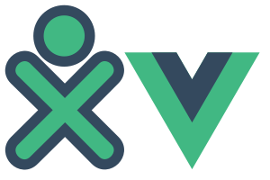
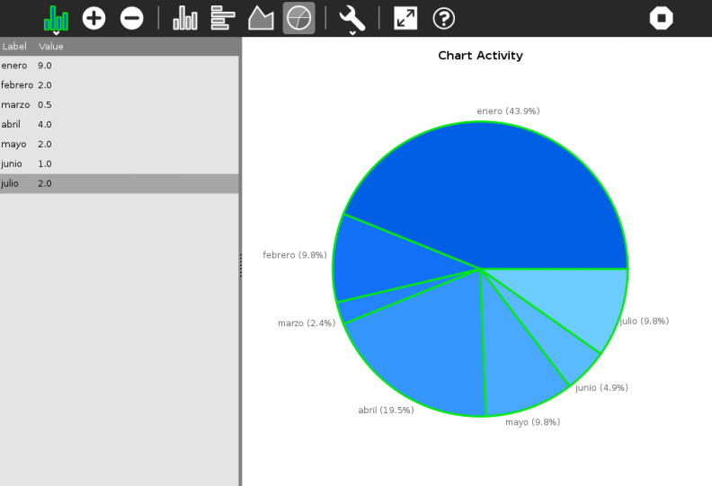
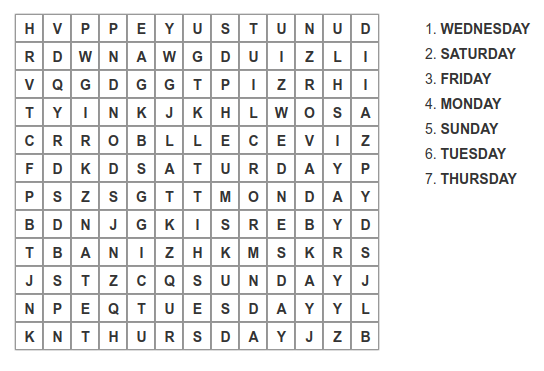

# GSoC 2023 Ideas

## Project Ideas
* [Improve and maintain 12 Sugar activities](#improve-and-maintain-12-sugar-activities)
* [Improve and maintain 6 Sugar activities](#improve-and-maintain-6-sugar-activities)
* [Port Sugar and core activities to Python 3](#port-sugar-and-core-activities-to-python-3)
* [Maintain/port Sugar activities to FlatPak](#maintain-port-sugar-activities-to-flatpak)
* [Maintenance/bug fixes for Music Blocks 3](#maintenace-bug-fixes-for-music-blocks-3)
* [Sugarizer VueJS Core](#sugarizer-vuejs-core)
* [Sugarizer Server Testing Improvement](#sugarizer-server-testing-improvement)
* [Sugarizer Word Puzzle and Chart activities](#sugarizer-word-puzzle-and-chart-activities)
* [GTK4 Exploration](#gtk4-exploration)

[Administrative notes](#administrative-notes)

------------

## Improve and maintain 12 Sugar activities

**Prerequisites** 
 - Experience with Python
 - Strong experience with Sugar activities
 - Experience with maintaining activities on ASLO and ASLO-v4

**Description** 
Sugar has a lot of activities, with 250+ on GitHub, and more
elsewhere. These have scope for improvement; bugs,
features, updated human translations, and release.  This project will involve
working on **at least 12** activities to improve them. Students can choose
activities on their own, and are encouraged to select activities which
are either a part of Fructose or have a strong pedagogical value. To
understand how to locate and work on activities, see our guide to
[Modifying
Activities](https://github.com/sugarlabs/sugar-docs/blob/master/src/contributing.md#modifying-activities)

In their proposal, students may mention _some_ of the issues they will
work on.  Any new feature suggestion should be discussed on GitHub
Issues or on the mailing list before being added to a proposal.

Since there are a lot of activities to work on, **more than one instance
of this project may be selected**.

**Suggested Issues to work on:** 
 - jukebox-activity: [#22 Add collaboration for sharing playlist items](https://github.com/sugarlabs/jukebox-activity/issues/22)

Other issues will have been raised since.

Suggesting or adding features, fixing bugs, or releasing activities
will help you to gain experience

**Project Length** 

**350** hours

**Difficulty** 

**Medium**

**Coding Mentors** 
[Ibiam Chihurumnaya](https://github.com/chimosky/),

**Assisting Mentors** 
To be added.

------------

## Improve and maintain 6 Sugar activities

**Prerequisites** 
 - Experience with Python
 - Strong experience with Sugar activities
 - Experience with maintaining activities on ASLO and ASLO-v4

**Description** 
Sugar has a lot of activities, with 250+ on GitHub, and more
elsewhere. These have scope for improvement; bugs,
features, updated human translations, and release.  This project will involve
working on **at least 6** activities to improve them. Students can choose
activities on their own, and are encouraged to select activities which
are either a part of Fructose or have a strong pedagogical value. To
understand how to locate and work on activities, see our guide to
[Modifying
Since there are a lot of activities to work on, **more than one instance
of this project may be selected**.

**Suggested Issues to work on:** 
 - jukebox-activity: [#22 Add collaboration for sharing playlist items](https://github.com/sugarlabs/jukebox-activity/issues/22)

Other issues will have been raised since.

Suggesting or adding features, fixing bugs, or releasing activities
will help you to gain experience.

**Project Length** 
**175** hours

**Difficulty** 

**Medium**

**Coding Mentors** 
[Ibiam Chihurumnaya](https://github.com/chimosky/),

**Assisting Mentors** 
To be added.

------------

## Port Sugar and core activities to Python 3

**Prerequisites** 
 - Experience with Python
 - Experience with porting telepathy bindings
 - Strong experience with
   [Sugar Desktop](https://github.com/sugarlabs/sugar) and [Activities](https://github.com/sugarlabs/sugar-docs/blob/master/src/contributing.md#modifying-activities)

**Description**  Support for Python 2 was withdrawn by the Python
Foundation, so we need to finish the move to Python 3.  The move was
started in GSoC 2018, and continued in GSoC 2020, but there is still
work to be done.  Sugar 0.116 runs on Python 2 or Python 3.  Core
activities run on Python 3.  Many other activities run on Python 2.
Many regressions have been seen as a result of code not being tested.

We have a [Python 3 Porting
Guide](https://github.com/sugarlabs/sugar-docs/blob/master/src/python-porting-guide.md)
which describes the process for activities.

**Project Task Checklist** 
 - Review the Sugar source code changes since 0.112 that were made for porting to Python 3,
 - Design tests and iterate until the tests have sufficient [coverage](https://github.com/sugarlabs/sugar-docs/blob/master/src/python-coverage-guide.md) for the code changes identified about,
 - Fix regressions in Sugar, the Toolkit, and the Datastore,
 - For affected activities, port Telepathy bindings to TelepathyGLib, see [Port to TelepathyGLib](https://github.com/orgs/sugarlabs/projects/4).
 - For affected activities, port to the latest Sugargame or CollabWrapper library,
 - Port activities to Python 3, fixing any problems that prevent them from being ported or used,

See GitHub Project [Port to Python 3 via
six](https://github.com/orgs/sugarlabs/projects/1) for some open
issues and pull requests.  Most activities do not have issues.  Some
activities have problems that prevent them from being ported.

The Telepathy library is used by some activities for network
collaboration between Sugar users.  The library does not have static
bindings for Python 3, so porting Telepathy to the PyGObject binding
is a prerequisite, see GitHub Project [Port to
TelepathyGLib](https://github.com/orgs/sugarlabs/projects/4).

**Project Length** 

**350** hours

**Difficulty** 

**Hard**

**Coding Mentors** 
[Ibiam Chihurumnaya](https://github.com/chimosky/)

**Assisting Mentors** 
To be added.

----

# Maintain Port Sugar Activities to Flatpak

**Prerequisites** 
 - Experience with Python
 - Strong experience with
   [Sugar Desktop](https://github.com/sugarlabs/sugar) and activities
Activities](https://github.com/sugarlabs/sugar-docs/blob/master/src/contributing.md#modifying-activities)

**Description** We have a number of Sugar Activities bundled with
  [Flatpak](https://flatpak.org/) as a way to reach a broader audience
  within the Linux community. We'd like to both keep those activities
  up to date and also port more.

Two quite popular acitivities are
[Pippy](https://beta.flathub.org/apps/details/org.sugarlabs.Pippy) and
[Physics](https://beta.flathub.org/apps/details/org.sugarlabs.Physics). Both
of these activities are using an unsupported version of pygame, so
they can no longer be updated. The first goal, then, of this project
would be to port these activities to pygame-2.0. Then, repackage them.

From there, we'd love to add more Sugar activities to the Flatpak
collection.

It would also be nice to include the physics plugin with the
TurtleBlocks Flatpak bundle, since it offers another fun way to create
projects for the Physics activity mentioned above.

**Project Length** 

**350** hours

**Difficulty** 

**Medium**

**Coding Mentors** 
[Martin Abente](https://github.com/tchx84/)
[Ibiam Chihurumnaya](https://github.com/chimosky/)
[Walter Bender](https://github.com/walterbender/)

-------------

# Maintenance/bug fixes for Music Blocks 3

**Prerequisites** 
 - Strong experience with JavaScript
 - Experience with basic music concepts

**Description** We are largely in maintenance mode for [Music
  Blocks 3.0](https://github.com/sugarlabs/musicblocks) while we
  continue to move forward on [Musick Blocks
  4.0](https://github.com/sugarlabs/musicblocks-v4). That said, there
  are a number of small bugs/regressions that would be worth fixing.

  See [low-hanging
  fruit](https://github.com/sugarlabs/musicblocks/issues?q=is%3Aissue+is%3Aopen+label%3A%22Good+first+issue%22)
  for a list of issues we'd like to close out during GSoC 2023.

**Project Length** 

**150** hours

**Difficulty** 

**Low**

**Coding Mentors** 
[Walter Bender](https://github.com/walterbender/)
[Devin Ulibarri](https://github.com/pikurasa/)

-------------

# Sugarizer VueJS Core

**Prerequisites** 
- Experience with JavaScript/HTML5 development
- Experience with Vue.js framework development
- Good understanding of Sugarizer Core architecture

**Project length** 
**175** hours

**Difficulty:** &#9733; &#9733; &#9734; (medium)

**Description** Sugarizer Core UI rely on EnyoJS, a deprecated frameworks initially developed for WebOS.  
 
Last year a GSoC project built the basic components stack of the Sugarizer UI (see [here](https://github.com/S-kus/Sugarizer_vueJs)). 
The idea of this new project is to reimplement a part of Sugarizer Core UI using VueJS components. 

**Tasks**  

Use Sugarizer VueJS components and Sugarizer Server API to implement screens: 
- First screen
- Login 
- Home view 
- List view 
- Settings 

Each screen should integrate unit testing and code coverage.

**First steps to starts** 

- Complete both the [Sugarizer Vanilla Javascript activity development tutorial](https://github.com/llaske/sugarizer/blob/dev/docs/tutorial/VanillaJS/tutorial.md) and the [Sugarizer Vue.js activity development tutorial](https://github.com/llaske/sugarizer/blob/dev/docs/tutorial/VueJS/tutorial.md).
- Explore the [VueJS Sugarizer UI components](https://github.com/S-kus/Sugarizer_vueJs) and try to use it in a web page.
- Read and test the L10N study [here](https://github.com/llaske/l10nstudy) because the first step of the project will be to create a localization component.

**Mentor** 
[Lionel Laské](https://github.com/llaske/)

-------------

# Sugarizer Server Testing Improvement 

**Prerequisites** 
- Experience with JavaScript/HTML5 development
- Experience with node.js and EJS framework
- Experience with unit testing tools

**Project length** 
**175** hours

**Difficulty:** &#9733; &#9733; &#9734; (medium)

**Description** 
This project aims to increase the quality of Sugarizer Server. It consists in improving the coverage of unit tests and adding interface tests but also in making some evolutions of the UI. 

**Tasks**  

- Improve unit testing: define real use case, implement new tests and ensure database is clean at the end of unit testing 
- Improve test coverage: add new test to improve test coverage ratio 
- Add some UI tests using [Selenium](https://www.selenium.dev/) testing tool
- Add a Github action to launch unit testing for each new commit on dev branch [#293](https://github.com/llaske/sugarizer-server/issues/293)
- Improve UI experience: 
    - Replace Bootstrap tour by IntroJS in tutorial [#363](https://github.com/llaske/sugarizer-server/issues/363)
    - Fix next page button in users/assignment view don't take into account search criteria [#364](https://github.com/llaske/sugarizer-server/issues/364)
    - Add users filtering while exporting [#313](https://github.com/llaske/sugarizer-server/issues/313)
    - Improve create assignment form: add a search activity in journal feature [#365](https://github.com/llaske/sugarizer-server/issues/365)
    - Add an export button to assignment deliveries [#366](https://github.com/llaske/sugarizer-server/issues/366)
    - Add a recent assignment deliveries widget in teacher home screen [#367](https://github.com/llaske/sugarizer-server/issues/367)

**First steps to starts** 

* Install Sugarizer Server and dashboard
* Create different Sugarizer users/teachers/classrooms and see how the dashboard work
* Play with current unit testing and propose improvement
* Study the source code of dashboard, try to fix bug or, propose improvement
* Learn how [Selenium](https://www.selenium.dev/) works and propose how it could be use to test Sugarizer Server dashboard UI

**Mentor** 
[Nikhil Mehra](https://github.com/NikhilM98/)
[Jaikishan Brijwani](https://github.com/ricknjacky/)

-------------

# Sugarizer Word Puzzle and Chart activities

**Prerequisites** 
- Experience with JavaScript/HTML5 development
- Experience with Vue.js framework development
- Experience with ReactJS framework development
- Good understanding of Sugarizer Core architecture

**Project length** 
**175** hours

**Difficulty:** &#9733; &#9733; &#9734; (medium)

**Description** The goal of this project is to develop new Sugarizer activities asked by teachers from Sugarizer deployments.

Specifically, the goal of this project is to:

- Develop a new Chart activity
- Add a new template Word Puzzle for Exerciser activity 
 
 

**Tasks**  

*Chart Activity*

The Chart activity will be inspired by the [Sugar Chart activity](https://help.sugarlabs.org/chart.html).  

The detailed features will be discussed with the project mentor but the new activity will at least reproduce current features of the activity and add new features (share the activity, export chart as image, ...).

*Word Puzzle template*

The new template Word Puzzle in Exerciser activity will enable a teacher to create word puzzles Exercise by inputting custom words on the go during a lesson and have the learners practice. 

The new template will allow to type words by text, images, sounds, speech or videos. It should work with the mouse and on touch devices.

The detailed features will be discussed with the project mentor but the new template will reproduce current features (edit, play, share, view results, convert to evaluation, ...) of other templates in Exerciser.

It's possible to take inspiration for this new template from [Learning Apps web site](https://learningapps.org/) which propose a Word Puzzle template too.

**First steps to starts** 

- Complete both the [Sugarizer Vanilla Javascript activity development tutorial](https://github.com/llaske/sugarizer/blob/dev/docs/tutorial/VanillaJS/tutorial.md) and the [Sugarizer Vue.js activity development tutorial](https://github.com/llaske/sugarizer/blob/dev/docs/tutorial/VueJS/tutorial.md).
- Study the [source code](https://github.com/llaske/ExerciserReact) of the Exerciser activity, try to fix bug or propose improvement
- Install Sugar and the Sugar Chart activity and play with it to understand its current features.

**Mentor** 
[Lionel Laské](https://github.com/llaske/)

-------------

# GTK4 Exploration

**Prerequisites** 
- Experience with C
- Experience with Python
- Experience with GTK
- Good understanding of Sugar Core architecture

**Project length** 
**350** hours

**Difficulty:** 
**Hard**

**Description** 
Sugar 0.120 runs on GTK3 and needs to be ported to GT4, we need to port Sugar and it's core activities to support GTK4 before GTK3 gets to its EOL.

**Project Task Checklist**
- Migrate minimal [sugar-toolkit-gtk3](https://github.com/sugarlabs/sugar-toolkit-gtk3) components to support Hello World activity, in particular the activity and graphics classes.
- Migrate [Hello World](https://github.com/sugarlabs/hello-world) activity.
- Document migration strategy based on extending any existing upstream GTK3 to GTK4 porting documentation.
- Migrate remaining toolkit components.
- Extend Hello World to use remaining toolkit components, and rename as a Toolkit Test activity,
- Migrate [Sugar](https://github.com/sugarlabs/sugar).
- Migrate the [Fructose](https://wiki.sugarlabs.org/go/Development_Team/Release/Modules) activity set, as time permits.

**Steps to start**
- Plan migration.
- Setup a [live build](https://github.com/sugarlabs/sugar/blob/master/docs/development-environment.md#sugar-live-build) development environment.
- See the [GTK4 migrating](https://docs.gtk.org/gtk4/migrating-3to4.html#stop-using-direct-access-to-gdkevent-structs) doc.

**Coding Mentors** 
[Ibiam Chihurumnaya](https://github.com/chimosky/)

-------------

# Administrative notes

Above are a list of ideas we've planned for GSoC 2023 projects.
If you have any ideas which can be useful to us, but are not in the
list, we'd love to hear from you.  You need not be a potential
student or a mentor to suggest ideas.

   * [Criteria for Ideas](#criteria-for-ideas)
   * [Coding Mentors](#coding-mentors)
   * [Assisting Mentors](#assisting-mentors)
   * [Everyone Else](#everyone-else)
   * [Suggested Issues](#suggested-issues)

## Criteria for Ideas
1. Does it fill an empty pedagogy niche in the activity set for Sugar
   or Sugarizer,
2. Does it increase quality of our software products (Sugar, activities,
   Music Blocks, or Sugarizer),
3. Does it _not_ involve any project infrastructure, e.g. not another
   app store, web site, or developer landing page,
4. Do we have a developer _now_ who would be willing and able to do it
   if a student was not available, and who can _promise_ to do it if a
   student is not selected; these are shown as a _coding mentor_,

## Coding Mentors
For each idea, we must have offers from one or more _coding mentors_
willing and able to assist students with coding questions.

Requirements for a _coding mentor_ are a demonstrated coding ability
in the form of contributions of code to Sugar Labs.

Mentors for a project will be assigned after proposals are received.

## Assisting Mentors For each idea, we may have offers from
mentors _who do not code_ willing to assist students in various
other ways, such as gathering requirements, visual design,
testing, and deployment; these are shown as an _assisting
mentor_.

The only requirement for an _assisting mentor_ is _knowledge of
the project_.

Mentors for a project will be assigned after proposals are received.

## Everyone Else

Everyone else in Sugar Labs may also be involved with these
projects, through mailing lists, Wiki, and GitHub.

The difference between a _mentor_ and _everyone else_, is that a
_mentor_ is obliged to respond when a student has a question,
even if the answer is "I don't know."

When a _mentor_ receives a question for which the best forum is
_everyone else_, then they are to respectively redirect the
student to ask _everyone else_.  See [Be
flexible](https://github.com/sugarlabs/sugar-docs/blob/master/src/CODE_OF_CONDUCT.md#be-flexible)
and [When you are unsure, ask for
help](https://github.com/sugarlabs/sugar-docs/blob/master/src/CODE_OF_CONDUCT.md#when-you-are-unsure-ask-for-help)
in our Code of Conduct.

## Suggested Issues

For some ideas, there is a list of 'Suggested issues to work on'.
These may help you to get familiar with the project.  The more
you work on these issues, the more experienced you will be for
the project.  However, this is not a strict list.  You _should_
try and explore other issues as well.
